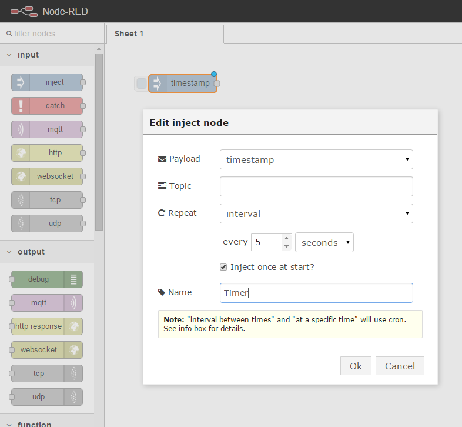
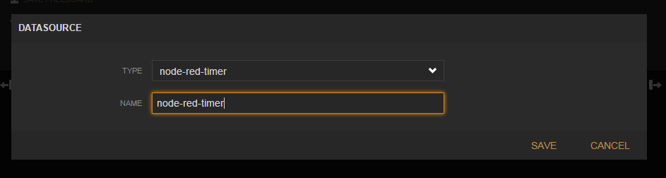
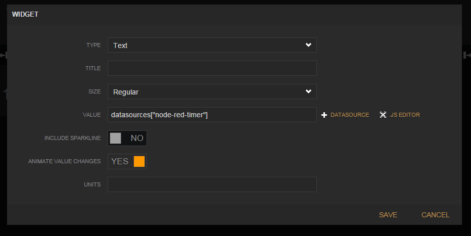

# node-red-pi

An easy way to get up and running with Node-RED on the Raspberry Pi. It also has [mosca](https://www.npmjs.com/package/mosca) which is an MQTT broker and a [freeboard plugin](https://www.npmjs.com/package/node-red-contrib-freeboard) installed to allow you to quickly setup realtime Dashboards.

## Why did I put this together ?

I was looking into [thethingbox](http://thethingbox.io/) but found a few things too limiting for my usage. Hopefully they can address these soon.

  * It didn't work out of the box when using WiFi, it also seemed to have problems with DHCP
  * Installing plugins was a pain because it was not setup like a regular Node-RED server
  * It had too many plugins out of the box for my liking
  * Could not be added to an exisitng Pi image

## Installation
This should be as easy as running:
```
git clone https://github.com/adamfr33man/node-red-pi.git
sudo ./install.sh
```

__This will take about half an hour to install__

It takes a little while to install all the dependencies through npm, but if you are doing this a lot then you could image a built version and use that.

## Usage

Mosca and Node-RED are installed as services and should start when you boot the Pi. If you want to start/stop them manually then you can do this like so:

```
sudo start mosca
sudo start node-red

sudo stop mosca
sudo stop node-red

sudo restart mosca
sudo restart node-red
```

## What does it include

  * Node 0.12.6 or later
  * Node-RED Latest
  * Mosca - a MQTT Broker
  * Bunyan - Pretty logging from Mosca
  * Freeboard - A realtime dashboard plugin

## Getting started

In a browser visit:
```
http://<pi ip address>:1880
```

Setup a timer like so



Drag over a freeboard module from the advanced section and name it node-red-timer and deploy the flow.


Next goto a new freeboard in you browser (note the tag after the # in the URL identifies this board when you save it)

```
http://<pi ip address>/freeboard/#node-red-timer
```

Click 'ADD' under 'DATASOURCES' and select 'node-red-timer' as your type and name.



Click 'ADD PANE' then click the '+' on your new pane. For type choose Text and value click '+ DATASOURCE' and select
```
datasources["node-red-timer"]
```



Click save and you should be able to see the timestamp change every 5 seconds. click 'SAVE FREEBOARD' then you can share it by URL.

## Logging

The log files are in /var/log as below

```
/var/log/mosca.sys.log
/var/log/node-red.sys.log
```
